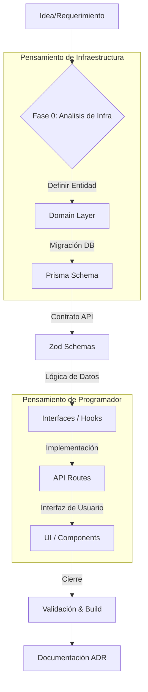

# 🔄 Ciclo de Vida de una Feature (Feature Lifecycle)

Este documento define el estándar de ingeniería para implementar funcionalidades en Simplapp V2. Pasar de "programador" a "ingeniero" implica seguir este flujo riguroso para garantizar la escalabilidad y reducir la deuda técnica.

## 📊 Diagrama de Flujo

---

## 🛠️ Fase 0: Pensar como Ingeniero de Infraestructura

Antes de tocar el teclado, un ingeniero se pregunta:
1.  **¿Dónde vive el dato?** (Normalización en PostgreSQL).
2.  **¿Cómo se valida en el borde?** (Zod en `@simplapp/domain`).
3.  **¿Es Multitenant?** (Asegurar que siempre filtre por `companyId`).

### Paso 1: El Contrato (Domain)
No empieces por la UI. Empieza por el **contrato**.
- Archivo: `packages/domain/src/entities/[Feature].entity.ts`.
- **Por qué:** Si el contrato está mal, todo lo que construyas encima (Hooks, API, UI) estará mal.

### Paso 2: El Almacén (Prisma)
- Archivo: `apps/web/prisma/schema.prisma`.
- **Acción:** `pnpm prisma generate`.
- **Ingeniería:** Define índices y relaciones. Un buen ingeniero optimiza la base de datos para lecturas rápidas.

---

## 💻 Fase 1: Pensar como Programador Senior

Aquí es donde conectas los cables de la infraestructura con la experiencia de usuario.

### Paso 3: Lógica Desacoplada (Interfaces)
- Ubicación: `packages/interfaces/src/hooks/features/`.
- **Regla de Oro:** La lógica de negocio **nunca** debe estar en el componente React. Si quieres cambiar de REST a GraphQL en el futuro, solo deberías tocar este paquete.

### Paso 4: La API (Edge)
- Ubicación: `apps/web/app/api/`.
- **Seguridad:** Validar sesión y pertenencia a la compañía (`getCurrentUser`).

---

## 🧪 Fase 2: Validación y Cierre

### Paso 5: UI Atómica
- Usa los componentes de `@simplapp/ui`.
- Si el componente no existe, créalo como un "átomo" reutilizable, no como algo específico de la página.

### Paso 6: El "Check de Ingeniería"
Antes de considerar la tarea terminada:
1. `pnpm build` (Desde la raíz). Si no compila, no existe.
2. `pnpm lint`.
3. **ADR (Architecture Decision Record):** Si tomaste una decisión importante (ej: "Usar Redis para este cache"), documéntalo en `.docs/decisions/`.

---

## 📝 Uso del Engineering Notebook (Obsidian)

Para cada feature, crea una nota con:
1.  **Contexto:** ¿Qué problema resuelve?
2.  **Trade-offs:** ¿Qué sacrifiqué (velocidad vs. perfección)?
3.  **Lecciones Aprendidas:** ¿Qué bug me detuvo 2 horas? (Esto es lo que te hace Senior).
