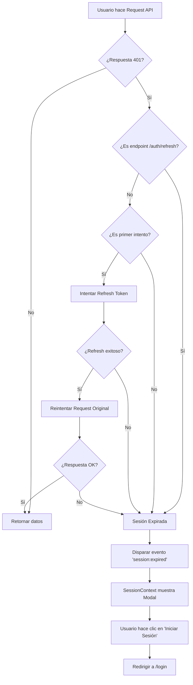
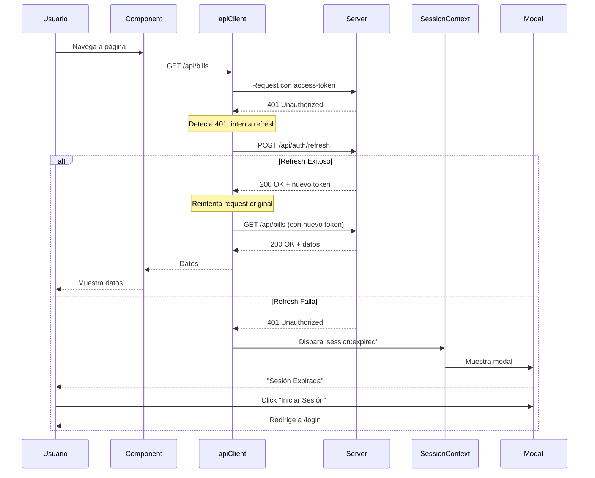
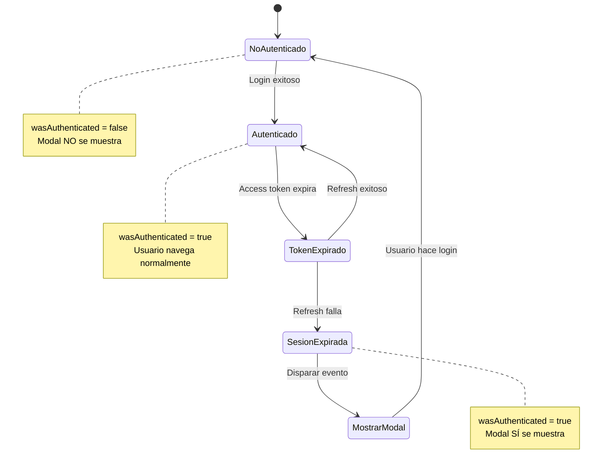
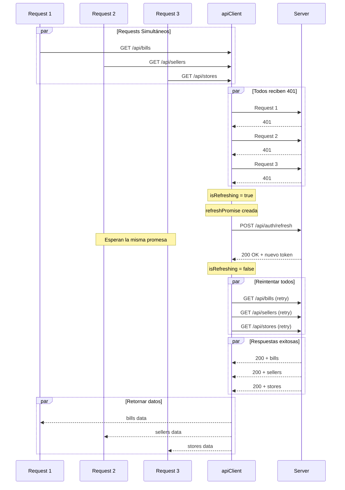
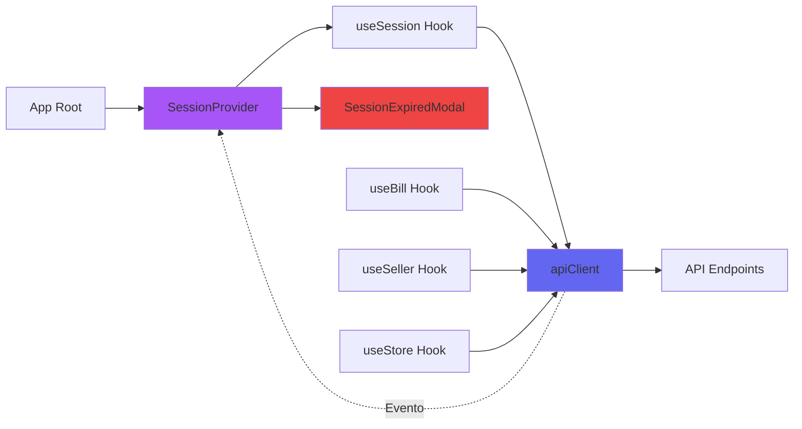
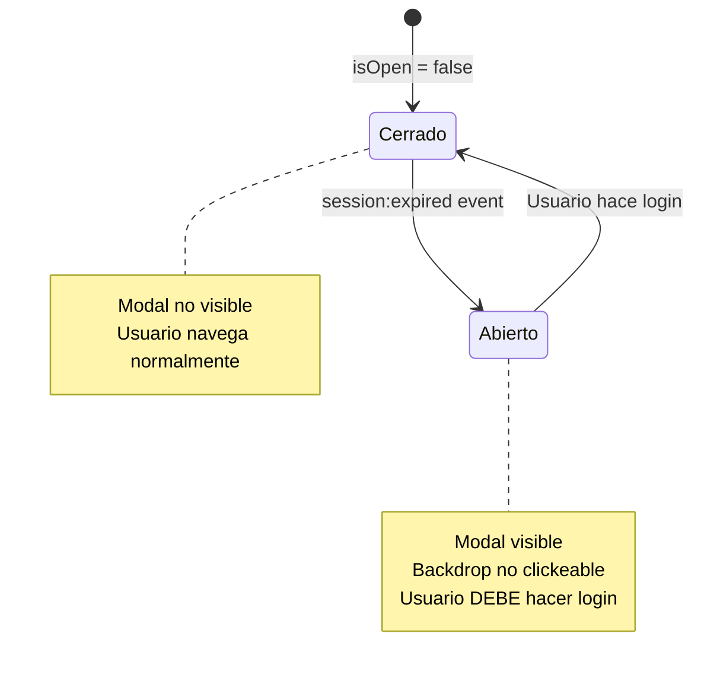
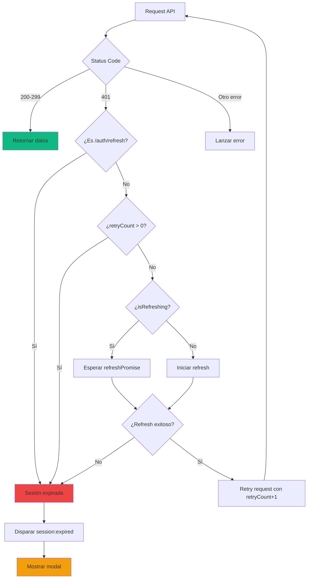
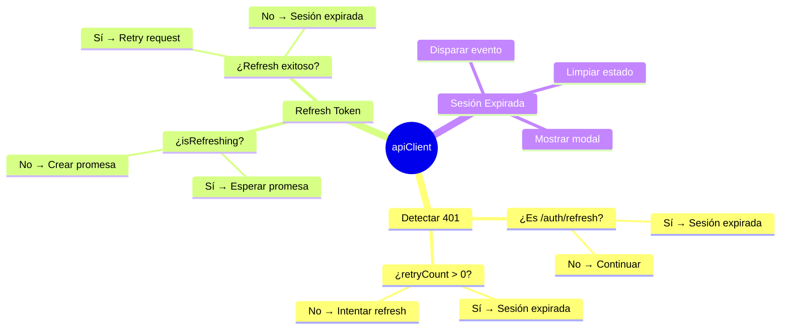

# Diagrama de Flujo - Sistema de Manejo de Sesiones

## 🔄 Flujo Principal de Autenticación



## 🔐 Flujo de Refresh Token



## 🎯 Flujo de SessionContext



## 🔄 Flujo de Múltiples Requests Simultáneos



## 📱 Flujo de Componentes



## 🎨 Estados del Modal



## 🔍 Decisiones del apiClient



## 📊 Ciclo de Vida del Token

```mermaid
gantt
    title Ciclo de Vida de Tokens
    dateFormat mm:ss
    axisFormat %M:%S
    
    section Access Token
    Token válido           :active, a1, 00:00, 15m
    Token expirado         :crit, a2, 15:00, 1m
    
    section Refresh Token
    Token válido           :active, r1, 00:00, 7d
    
    section Acciones
    Refresh automático     :milestone, 15:00, 0m
    Mostrar modal          :crit, milestone, 7d, 0m
```

## 🎯 Puntos de Decisión Clave



---

## 📝 Leyenda de Colores

- 🟢 **Verde**: Flujo exitoso
- 🔴 **Rojo**: Error o sesión expirada
- 🟣 **Morado**: Componentes principales
- 🔵 **Azul**: Servicios y utilidades
- 🟡 **Amarillo**: Acciones del usuario

---

## 🔗 Referencias

- [Implementación Detallada](./session-management-implementation.md)
- [Resumen Ejecutivo](./session-implementation-summary.md)
